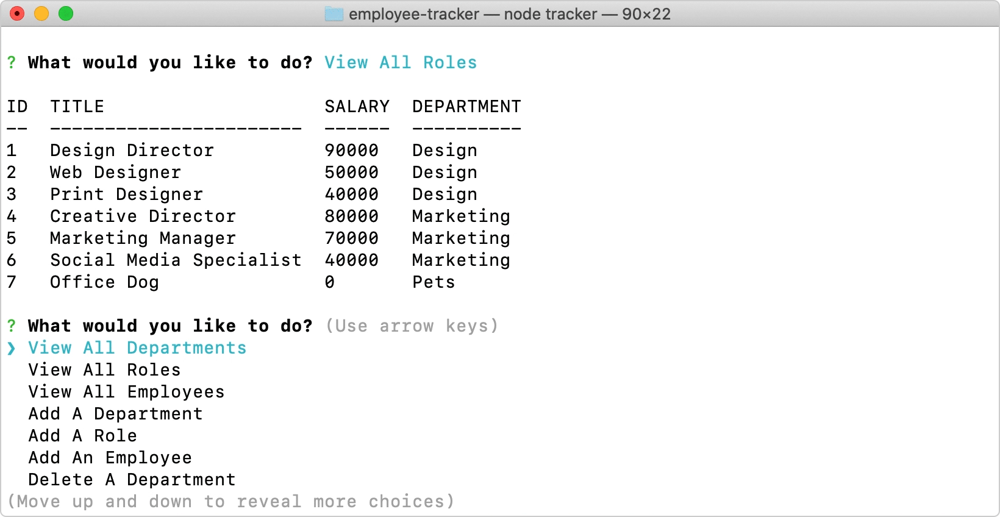

# Employee Tracker
A simple command-line application for managing a company's employees using node, inquirer, and MySQL.

    


## User Story
```
As a business owner
I want to be able to view and manage the departments, roles, and employees in my company
So that I can organize and plan my business
```


## Functionality
```
sdfv
```


## Table of Contents 
* [Install](#installation)
* [Usage](#usage) 
* [Walkthrough](#walkthrough)   
* [Credits](#credits)
* [Questions](#questions) 
* [Donate](#donate)
* [License](#license) 


## Installation
* Download this repository or fork and clone it to your local device.
* Run an `npm install` to install all of the dependencies:
```
npm install
```
* Update the `tracker.js` file with your `localhost` connection password on line 12:
```
const connection = mysql.createConnection({
  host: 'localhost',
  port: 3306,
  user: 'root',
  password: 'p@ssw0rd',
  database: 'employeeDB'
});
```
* Run the `schema.sql` file through MySQL or your command line to create your database and tables:
```
mysql -u root -p < schema.sql
```


## Usage 
* Start the application by typing `node tracker` in your command line:

 

* Select a choice when prompted and continue to make changes for as long as you'd like:

 

* When you're done, you can select `Exit` at the end of the main menu choices or `^c` at any time:

 


## Walkthrough
[](https://youtu.be/ksIIrCnMJVY)   


## Credits
This CLI App wouldn't run without [Inquirer](https://www.npmjs.com/package/inquirer) or [MySQL](https://www.npmjs.com/package/mysql). [Chalk](https://www.npmjs.com/package/chalk) and [console.table](https://www.npmjs.com/package/console.table) also helped make the content more readable in the console. 


## Questions
If you have any questions, feel free to find me at:
* Email: laurensiminski@gmail.com
* Website: https://siminski.co
* Github: [@siminski](https://github.com/siminski)


## Donate
Appreciate this code? Say thanks with a coffee:

[](https://ko-fi.com/W7W21YVJJ)


## License
Copyright (c) 2020 Lauren Siminski.